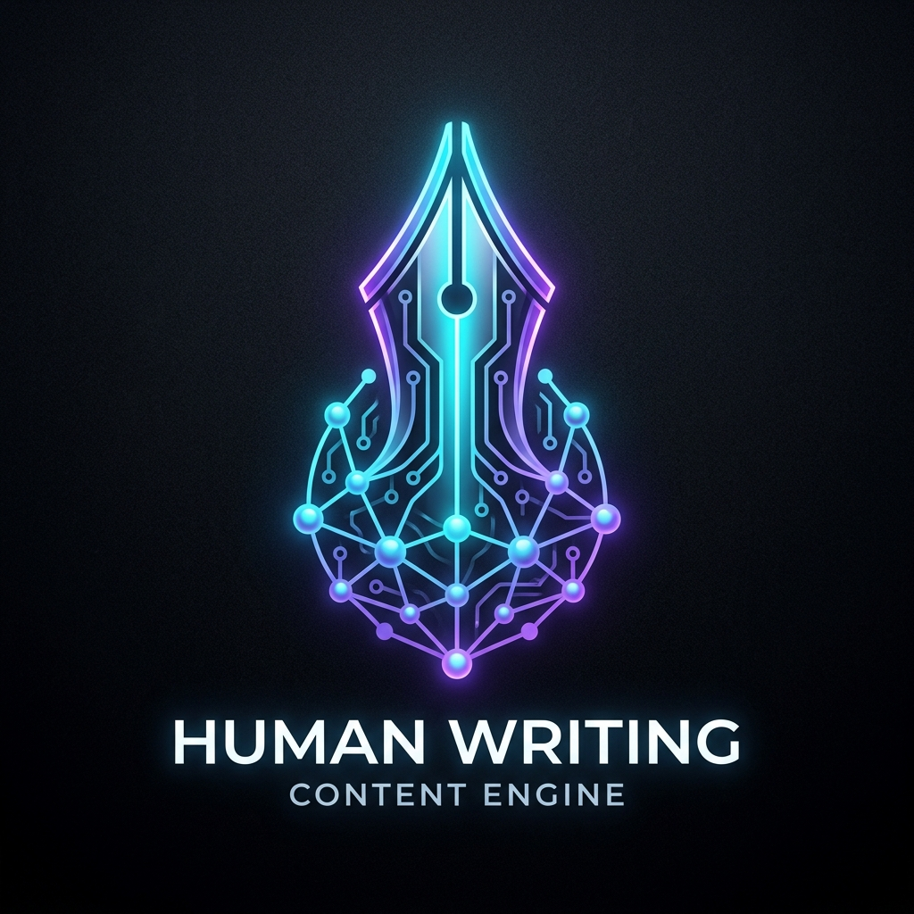

<h1 align="center">
  <br>
  <a href="https://github.com/chuanman2707/human-writing"></a>
  <br>
  Human Writing
  <br>
</h1>

<h4 align="center">Hệ thống AI chuyển hóa tin công nghệ từ X.com thành bài viết Facebook chuẩn văn phong Tech Builder & Software Engineer, triệt tiêu 100% AI Slop.</h4>

<p align="center">
  <a href="https://github.com/chuanman2707/human-writing/blob/main/LICENSE">
    
  </a>
  <a href="https://github.com/chuanman2707/human-writing/stargazers">
    
  </a>
  <a href="https://github.com/chuanman2707/human-writing/network/members">
    
  </a>
  <a href="https://github.com/chuanman2707/human-writing/issues">
    
  </a>
  <a href="https://antigravity.google">
    
  </a>
  <a href="https://anthropic.com/claude-code">
    
  </a>
</p>

<p align="center">
  <a href="#key-features">Key Features</a> •
  <a href="#how-to-use">How To Use</a> •
  <a href="#the-5-part-formula">The 5-Part Formula</a> •
  <a href="#architecture">Architecture</a> •
  <a href="#anti-slop-standards">Anti-Slop Standards</a> •
  <a href="#credits">Credits</a> •
  <a href="#license">License</a>
</p>

<p align="center">
  
</p>

---

## Key Features

* **Always-On Trigger Pipeline**
  - Tự động nhận diện khi bạn paste link tweet, trích dẫn thread hoặc tin tức công nghệ từ X.com. Không cần câu lệnh mào đầu rườm rà.
* **Senior Tech Builder Persona**
  - Xưng hô "mình" - "anh em" / "coder tụi mình". Văn phong tỉnh táo, phản biện lành mạnh (sober & pragmatic), nhìn công nghệ dưới lăng kính production thực chiến.
* **Strict Output Contract (1-Click Copy)**
  - Toàn bộ bài viết hoàn chỉnh nằm trọn trong **DUY NHẤT 1 code block dạng `text`**, đi kèm đúng 2 dòng gợi ý comment giữ reach và visual đính kèm.
* **The 5-Part Formula**
  - Cấu trúc 5 khối tối ưu trải nghiệm đọc lướt trên điện thoại di động: Hook giật $\rightarrow$ Dữ liệu & Specs $\rightarrow$ Góc nhìn Coder/Builder $\rightarrow$ "Mình nghĩ..." $\rightarrow$ CTA mở.
* **Dual-Engine Anti-Slop (Humanizer tiếng Việt)**
  - Tích hợp bộ lọc 25 quy tắc khử sạch thói quen hành văn máy móc: triệt tiêu từ cấm, loại bỏ tương phản sáo rỗng Not-X-but-Y, xóa sạch tàn dư chatbot.
* **Zero Reach-Penalty Growth Hack**
  - Tự động điều hướng mọi liên kết ngoài (external URL) xuống phần bình luận đầu tiên nhằm giữ trọn vẹn điểm phân phối thuật toán của Facebook.
* **Cross-Agent Compatibility**
  - Hỗ trợ song song cả **Google Antigravity** (`.agents/skills/`) lẫn **Anthropic Claude Code** (`.claude/skills/`, `CLAUDE.md`).

---

## How To Use

Để sử dụng bộ công cụ này, bạn chỉ cần clone repository về máy tính và mở trong AI agent yêu thích (**Antigravity** hoặc **Claude Code**).

```bash
# Clone repository này về máy
$ git clone https://github.com/chuanman2707/human-writing.git

# Di chuyển vào thư mục dự án
$ cd human-writing
```

### Sử dụng với Google Antigravity
1. Mở workspace `human-writing` trong **Antigravity**.
2. Thả bất kỳ link tweet từ X.com, trích dẫn văn bản hoặc ảnh chụp màn hình bài đăng công nghệ vào khung chat.
3. Hệ thống sẽ tự động kích hoạt tổ hợp `fb-tech-writer` và `humanizer` để trả về bài viết hoàn chỉnh.

### Sử dụng với Anthropic Claude Code
Khởi chạy Claude Code trong thư mục dự án:

```bash
$ claude
```

Khi bạn paste đường dẫn hoặc nội dung tweet, Claude Code sẽ tự động đọc chỉ dẫn tại [`CLAUDE.md`](CLAUDE.md), gọi skill tương ứng từ [`.claude/skills/`](.claude/skills/) và xuất bài theo đúng chuẩn.

---

## The 5-Part Formula

Mỗi bài viết được xuất ra đều tuân thủ nghiêm ngặt cấu trúc 5 khối giúp giữ chân người đọc ngay từ 2 dòng đầu tiên:

| Khối | Tên khối | Vai trò & Quy cách |
|:---:|---|---|
| **1** | **Hook Giật Mở Đầu** | Đập vào mắt trong 2 dòng đầu trước nút "Xem thêm". Dùng cảnh báo chấn động (`🚨 ... 🤯/🥶`), drama đời thường (`Trời ơi... 😭`), hoặc bóc phốt benchmark. |
| **2** | **Fact & Dữ Liệu Cốt Lõi** | Số liệu định lượng (thời gian, % tốc độ, Before/After). Trình bày ngắn gọn bằng bullet points (-) dễ đọc lướt trên mobile. |
| **3** | **Góc Nhìn Builder / Coder** | Soi chiếu tác động thực tế đối với coder/product maker. Dùng các công cụ dev quen thuộc (Claude Code, git, test, reverse engineering) làm hệ quy chiếu. |
| **4** | **Insight Cá Nhân ("Mình nghĩ...")** | **Bắt buộc mở đầu bằng `Mình nghĩ...`** kèm emoji `😰` hoặc `🥶`. Nêu bước chuyển dịch của ngành kết hợp phản biện tỉnh táo về chi phí và rủi ro. |
| **5** | **Growth Hack CTA** | Tuyệt đối không chèn link vào thân bài. Kết bài bằng **ĐÚNG 1 câu hỏi mở** kích thích tranh luận, kết thúc bằng icon chỉ tay xuống `👇`. |

---

## Architecture

Cấu trúc dự án được phân tách rõ ràng, tương thích hoàn hảo cho các nền tảng agent hiện đại:

```text
human-writing/
├── assets/                                       # Logo, banner và hình ảnh minh họa cho repo
│   ├── logo.jpg
│   └── banner.jpg
├── AGENTS.md                                     # Quy tắc điều phối cho Google Antigravity Workspace
├── CLAUDE.md                                     # Quy tắc chỉ dẫn dự án cho Anthropic Claude Code
├── README.md                                     # Tài liệu tổng quan dự án
├── .gitignore                                    # Loại trừ tài liệu nội bộ (docs/) & file rác OS
├── .claude/                                      # Chuẩn kỹ năng cho Anthropic Claude Code
│   └── skills/
│       ├── fb-tech-writer/                       # Kỹ năng viết bài Tech Facebook chuyên sâu
│       │   ├── SKILL.md
│       │   └── references/examples.md            # Kho 6 bài mẫu thực tế kèm giải phẫu kỹ thuật
│       └── humanizer/                            # Bộ lọc khử văn phong AI (bản ngữ hóa tiếng Việt)
│           ├── SKILL.md                          # 25 quy tắc loại bỏ thói quen hành văn máy móc
│           └── README.md
└── .agents/                                      # Chuẩn kỹ năng cho Google Antigravity
    └── skills/
        ├── fb-tech-writer/
        └── humanizer/
```

---

## Anti-Slop Standards

Hệ thống tích hợp bộ lọc **Humanizer** với 25 mẫu nhận diện được bản ngữ hóa riêng cho tiếng Việt:

* **Xóa 100% từ cấm sáo rỗng:**
  *"Trong bối cảnh..."*, *"Thời đại số..."*, *"Không chỉ là A mà còn là B..."*, *"Hãy cùng khám phá..."*, *"Bạn có bao giờ tự hỏi..."*, *"Đây là minh chứng rõ ràng cho..."*, *"Bức tranh toàn cảnh..."*.
* **Giữ nguyên 100% thuật ngữ kỹ thuật bản địa:**
  `workflow`, `rollout`, `production`, `API`, `agent`, `repo`, `debug`, `benchmark`, `latency`, `context window`, `inference`, `prompt`, `pull request`, `refactor`, `pipeline`, `token`, `open-weight`, `local`...
* **2-Pass Pipeline:**
  - **Pass 1 (Drafting):** Bóc tách sự thật kỹ thuật và dựng khung bài theo công thức 5 phần.
  - **Pass 2 (Anti-Slop & Humanizing):** Rà soát qua 25 quy tắc của Humanizer, loại bỏ cấu trúc Not-X-but-Y, gạch ngang làm từ nối vạn năng và tàn dư chatbot.

---

## Output Example

Dưới đây là một ví dụ đầu ra chuẩn từ hệ thống:

```text
🚨 OpenAI vừa nâng cấp ChatGPT Images lên 2.5, và lần này không chỉ là ảnh đẹp hơn đâu anh em 🤯

Cái kinh khủng nhất là tính năng Dynamic Control:
- Nhấn trực tiếp vào bất kỳ vùng nào trên ảnh để prompt riêng cho chi tiết đó
- Giữ nguyên 100% consistency của background và ánh sáng xung quanh
- Thời gian render giảm từ 12s xuống còn 3.8s trên mỗi lượt edit
- Xuất layer tách biệt trực tiếp sang PNG transparent

Với anh em build sản phẩm thì đây chính là bước chuyển dịch từ "vẽ cho vui" sang workflow làm asset game và UI thật. Thay vì phải ngồi hì hục mask từng pixel trong Photoshop hay nạp LoRA chỉnh controlnet, anh em chỉ cần click và gõ đúng 1 dòng lệnh.

Mình nghĩ tính năng này sẽ làm rung chuyển toàn bộ các công cụ dựng mockup hiện tại 😰. Nhưng mà khoan vội hype quá đà: chi phí API khi rollout hàng loạt vẫn là một ẩn số lớn, và độ trễ 3.8s vẫn chưa đủ nhanh cho các tính năng realtime trên app người dùng.

Anh em đã test thử tính năng selective edit này trong workflow hàng ngày chưa? 👇
```

💬 **Gợi ý Comment:** Link bài test benchmark chi tiết và video demo màn hình anh em xem tại đây: https://x.com/...  
🖼 **Gợi ý Visual:** Ảnh chụp màn hình split-screen: bên trái là công cụ chọn vùng click edit trên ảnh, bên phải là inspector hiển thị layer transparent vừa xuất.

---

## Credits

Dự án sử dụng và kế thừa các tiêu chuẩn mã nguồn mở uy tín:

* [Wikipedia: Signs of AI writing](https://en.wikipedia.org/wiki/Wikipedia:Signs_of_AI_writing) - Dự án WikiProject AI Cleanup.
* [blader/humanizer](https://github.com/blader/humanizer) - Bộ quy tắc phát hiện và khử AI slop gốc.
* [Amit Merchant](https://github.com/amitmerchant1990) - Cảm hứng thiết kế README từ [electron-markdownify](https://github.com/amitmerchant1990/electron-markdownify).

---

## License

Phát hành dưới giấy phép [MIT](LICENSE).

<p align="center">
  Được phát triển bởi <a href="https://github.com/chuanman2707">chuanman2707</a> cho cộng đồng Tech Builders & Engineers 🇻🇳
</p>
